# Assn1_DSP
## Team member
Wei Fan(wei.fan@vanderbilt.edu Github id: FWWorks)  
Dingjie Su(dingjie.su@Vanderbilt.Edu Github id: sudmat)  
Zhehao Zeng(zhehao.zeng@vanderbilt.edu Github id: frankvandy2018) 

## Project code
https://github.com/FWWorks/Assn1_DSP

## Abstract
We built a layer upon the PUB/SUB model supported by ZMQ to support anonymity between publishers and subscribers. 
To be specific, we provide two ways as to how data disseminated from publishers and subscribers. One way is, that we wrote code to support the publisher’s middleware layer directly sending the data to the subscribers who are interested in the topic being published by this publisher. Another approach allows the publisher’s middleware always send the information to the broker, who then sends it to the subscribers for this topic. 
Our team also conducted performance measurement experiments to get a sense of the impact on amount of data sent, latency of dissemination, pinpointing the source of bottlenecks.
The code is written in Python3.5 and we use Mininet to build single topologies to test our code, which runs on Linux Ubuntu.

## What we implemented
### Two approaches to data disseminating from publishers and subscribers. 
To be more specific, both for publisher’s middleware layer directly sending the data to the subscribers or for publisher’s middleware sending the information to the broker, who then sends it to the subscribers for this topic. In both ways, we provide APIs for publisher/subscriber registering the system, publisher publishing messages under topics, subscriber receive the messages which come from the topics it is interested in. 
### APIs for publishers and subscribers leaving any time. 
We realized the functions for publishers and subscribers leaving the system, publisher canceling a topic, subscribers unsubscribing a specific topic. 
### Heartbeat sending and timeout handling
A publisher or a subscriber sends heartbeat messages to the broker once it registers to be a member in the system. And if the broker haven’t received a heartbeat message from a publisher/subscriber, the broker will drop this member out from the system because there must be something wrong with the member. 

## How to run our code
### step 0 Get prepared.

1 Clone this repo.

2 Install python3.6

3 Install dependencies using "**pip install -r requirements.txt**"

The directory of our program with a brief description is as following.

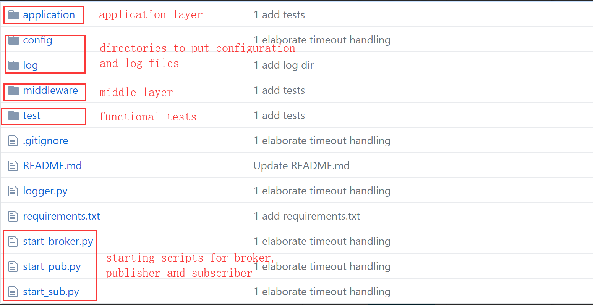

### Step 1 Create a network topology using mininet.
For our example, we use the simplest topology with 3 nodes with their ips

h1=10.0.0.1 (broker)

h2=10.0.0.2 (publisher)

h3=10.0.0.3 (subscriber)

### Step 2 Modify the configurations for broker, publisher and subscriber.
All the configurations are .ini files in config/.

A sample configuration for each of broker, publisher and subscriber is showed below.

You can have several configuration unit in a single .ini file, and specify which unit to use through commands.

It's crucial to make sure that the broker, publisher and subscriber are under the same mode (either 1 or 2, but not mixed).
Multiple publishers and subscribers are allowed, although not showed here for simplicity.

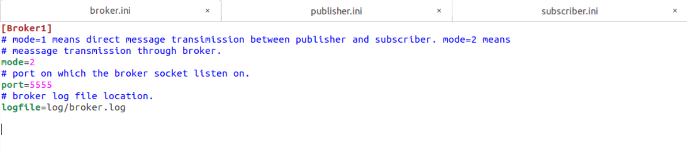
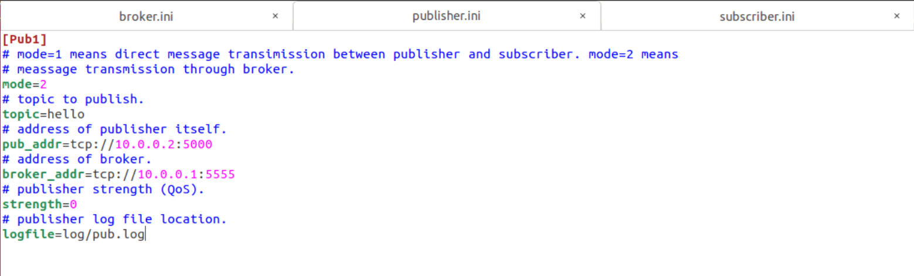
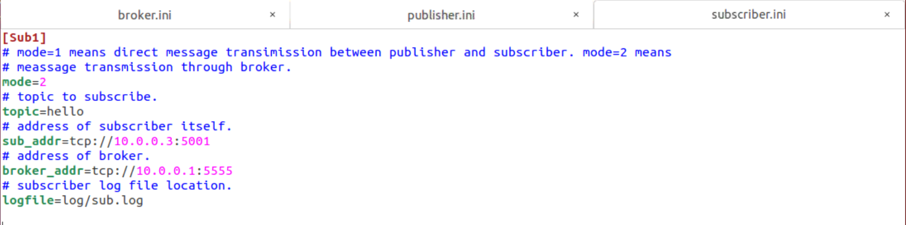

### Step 3 Start the broker.
Start the broker using "**python3 start_broker.py config/broker.ini Broker1**".

The parameter "config/broker.ini" specifys which configuration we are using.

The parameter "Broker1" specifys which config unit in the configuration file we are using.

Please make sure broker is started before publisher and subscriber.

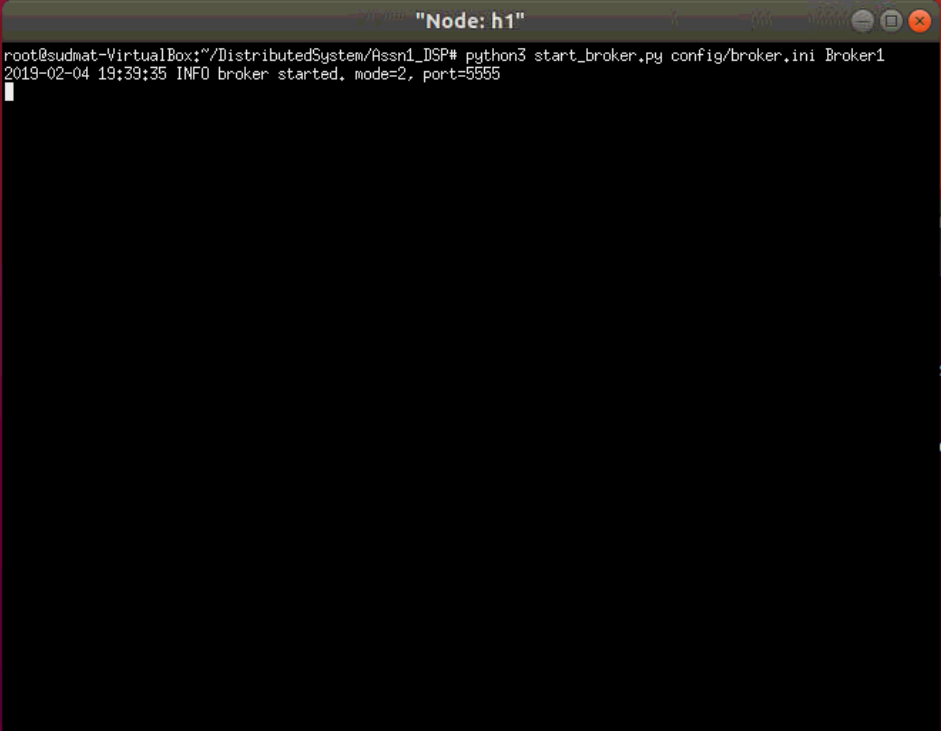

### Step 4 Start the publisher.
Start the publisher using "**python3 start_pub.py config/publisher.ini Pub1**".

This command is in a similar form as that for broker.

After the publisher is started, you can type messages you want to publish in that window.

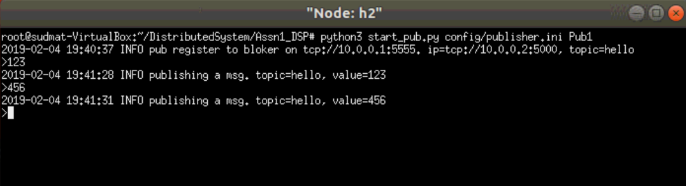

### Step 5 Start the subscriber.
Start the publisher using "**python3 start_sub.py config/subscriber.ini Sub1**".

This command is in a similar form as that for broker.

After the subscriber is started, you can publish messages through publisher and see what are received in the subscriber window.

Note that all messages published before a subscriber getting started are dropped.

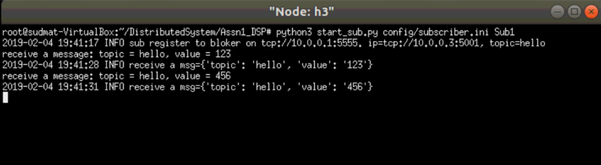

## Test case
To execute the tests, use "**python3 -m pytest test/**".

Tests cover pub/sub registration, message publishing, message receiving under both transmission modes.

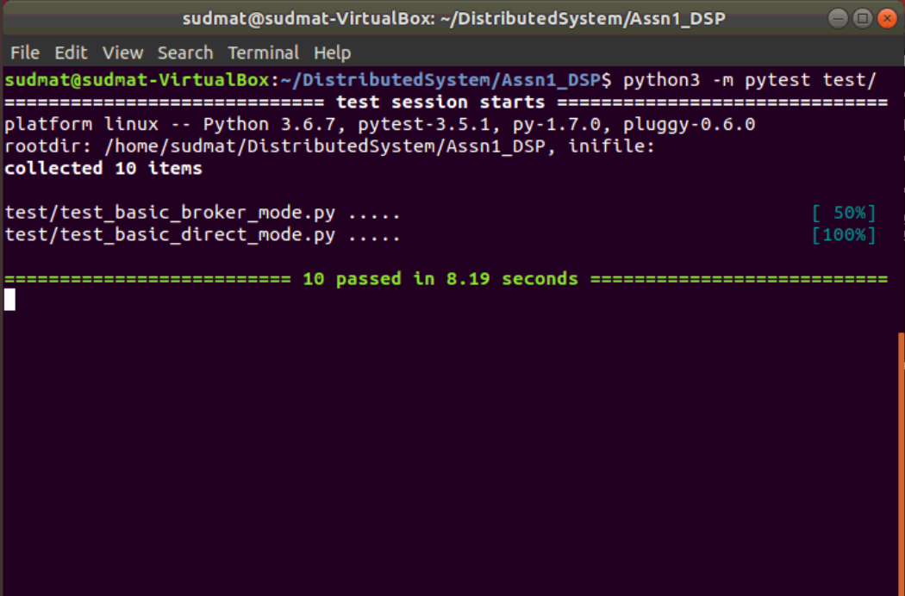

## Performance measurement
We did some performance test on the data amount and subscriber's number for both two approaches of pub/sub model we realized and collected the performance data. Related code and data can be found in the 'performance data' file folder.

For simply notation, let's call the approach in which subscribers get address of publisher from broker and request message directly from the publisher mode1/approach1, and the approach in which subscribers receive messages from broker mode2/approach2. 

We measure performance according to the response time of intervals between a message being published by a publisher and reveived by a subscriber. For example, if a publisher publishs a message at time A, and this message is successfully received by a subscriber at time B, the intervals(B-A) is what we use to measure the preformance of pub/sub model. For each test, we generated 10 messages and calculate the average response time of delivery time of the 10 messages as response time. 

We conducted performance by varying number of subscribers or varying the data amount for both two approaches to see if data amount or subscriber amount will effect the response time. 

First, we did performance measurement test on mode1/approach1.

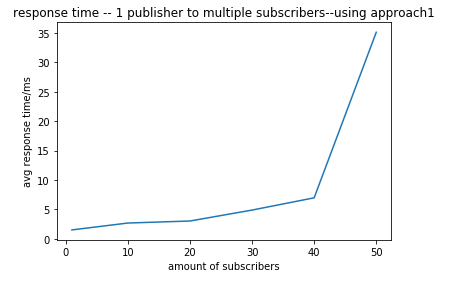

From this plot we can see, with the subscriber's amount increasing, the average response time shows a positive correlation trend. The average response time ranges from 1 ms(for 1 subscriber) to 35 ms(for 50 subscribers).

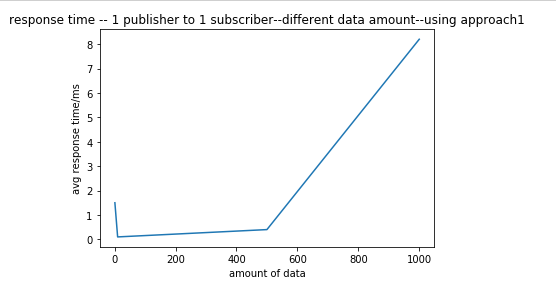

We write scripts to generate different sizes of message(ranges from 1b to 1000b) and apply various data amount to a pub/sub system which only has one publisher and one subscriber. From the plot, we observe the average response time shows a positive correlation trend with data amount, from 1 ms to 8 ms. 

Then we did the same experiments on mode2/approach2.

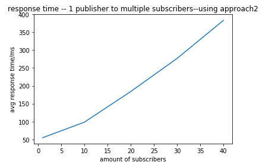

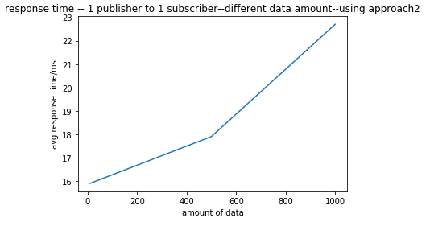

From these results, we can draw the same result like what is described in the tests of approach1, that is, both data amount and subscribers amount influences the performance of response time. The larger data publisher sends, the more subscribers the network contains, the more time it takes to convey the message, which means a descrease in the performance. 
But, what makes approach1 and approach2 different is the response time range. It's obvious that using approach2 takes much more time than using approach1 under the same settings. So that's maybe where the bottleneck is, that it takes much time for broker to send messages to subscribers. So to solve this bottleneck, maybe we should do something to make the process of mapping publishers to subscribers faster.

